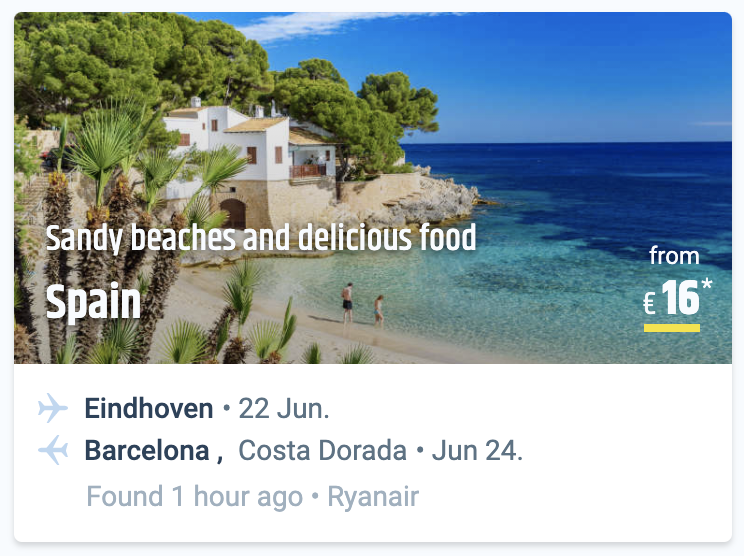

# Travix Front-End Tech Assignment #02

The goal of this task is to implement a slot widget based on the provided image 
([Slot Widget Design](https://github.com/Travix-International/fe-tech-test/blob/master/assignment-02/slot-widget.png))
and show multiple slot widgets in a responsive design.

Note: Slot widget is a component that shows information about a destination, and the cheapest flight to that destination.
(Please check the mobile version of https://www.cheaptickets.nl/ for similar components)

A simple server has been implemented with Express, you need to first fetch the slot widgets' information, and then for each slot widget, 
you need to fetch the fare information by fareId. This server is not perfect. It could be improved and tested as well.

Please save the fare in Redux and then provide it to the components by reading it from the Redux store.

The goal is to create a page displaying multiple widgets based on the data from the server. Page consists of multiple rows and 
each row should have 3 widgets for desktop, 2 for smaller devices and then 1 item per row for mobile.

## Requirements

* React 17+
* Redux
* Good state management
* Modular CSS
* Responsive design
* Linting
* Unit tests

## Bonus

* Typescript
* CSS-in-JS
* Integration/E2E tests
* Automated deployment
* Storybook
* Impress us!
